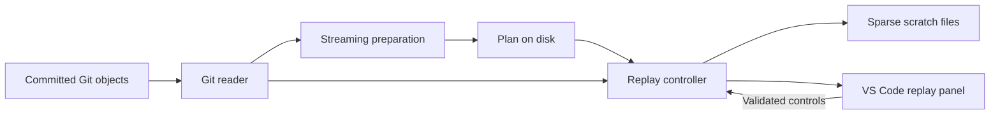

# Isolated Git replay design

Date: 2026-09-10
Status: Proposed design accompanying the requested implementation plan. No application code has been written.

Build a VS Code extension that replays committed changes in a dedicated panel, with an animated pointer and gradual code edits. The user can continue using their real mouse, keyboard, editor, and other applications. The panel is a Git replay visualization; its pointer movements are internal animations, not operating-system input events.

## Decisions and requirements

The user requested a starting commit through the latest commit, actual reconstruction of added/replaced/deleted code, adjustable typing and mouse behavior, a total duration such as six hours, isolation from normal computer use, and low time and space costs.

Use an isolated webview with a sparse scratch store. This is the recommended interpretation of “do the best”: it provides the requested visible playback without taking desktop focus. VS Code supports custom HTML-based extension panels through its [Webview API](https://github.com/microsoft/vscode-docs/blob/main/api/extension-guides/webview.md). The scratch store contains real file bytes after each file finishes playing; incomplete typing remains in the playback model until that save boundary.

Alternatives considered:

| Approach | Result | Decision |
| --- | --- | --- |
| Extension webview and animated pointer | Independent playback, modest setup, bounded rendering | Select |
| Separate virtual machine with desktop automation | Actual editor and independent guest input; another OS and automation stack to maintain | Defer unless native editor playback becomes a requirement |
| Automation of the host desktop | Uses the same input and focus as the user | Does not satisfy isolation |

Git snapshots cannot recover the author's original keystrokes, edit ordering within a commit, or pauses. Playback reconstructs a deterministic sequence from actual differences. It is not a recording of the original work session, and no claim is made that it bypasses a screen tracker or proves hours worked.

## Global constraints

These lines must also appear verbatim in the implementation plan.

- Target: desktop VS Code 1.137 or later; local, trusted Git workspaces only; macOS first, with Windows and Linux compatibility checks before claiming support.
- Toolchain: TypeScript, Node.js 22 or later for development checks, Git 2.45 or later, and the Node.js runtime provided by VS Code for execution.
- Runtime dependencies: none beyond VS Code and the installed Git executable; use Node.js and browser standard APIs.
- Input isolation: no operating-system mouse events, keyboard injection, focus stealing, or source-editor edits.
- Source isolation: read committed Git objects only; do not change the source working tree, index, refs, Git configuration, or uncommitted files.
- History: include the selected starting commit and the pinned ending commit; replay the ending commit's first-parent history in oldest-to-newest order.
- Concurrency: one replay session, one active file, and at most two Git child processes per extension host; explicit disposal owns all processes and timers.
- Animated text limits: at most 1 MiB per old/new blob and 8 KiB per logical line; other regular files use a snapshot event preserving their original bytes.
- Rendering limits: at most 120 visible code rows and 64 KiB of code text per frame; at most 10 host updates per second and 30 pointer animation frames per second while moving.
- Storage: default session quota is 1 GiB including scratch data, manifests, plans, and temporary writes; check quota before allocation and permit an explicit increase in settings.
- Timing: duration mode takes priority over typing speed; speed mode takes priority over the displayed duration estimate; explicit pauses and preparation/I/O stalls extend completion time.
- Validation: use built-in node:test and node:assert/strict, temporary Git repositories, and manual VS Code checks; add no test framework.

Version floors are proposed compatibility targets, not a claim of completed compatibility testing. Pin development dependency versions and commit the lockfile during implementation.

## User flow

1. Run **Git Replay: Open** from the command palette. Select a repository if the workspace has several.
2. Choose a starting commit from a paginated first-parent history. Show hash, subject, and date. Pin the ending commit to the current HEAD when preparing the session. Commits created afterwards are outside that session.
3. Select either **Finish in duration** or **Fixed typing speed**. Show typing units as characters per second, pointer speed, and the resulting duration estimate. Supply start, pause, resume, stop, and restart controls; restart reuses the prepared plan with a fresh scratch run.
4. Prepare with cancellable progress: count commits, changed file occurrences, text edits, snapshot events, estimated space, and the shortest supported duration. Empty commits remain visible milestones.
5. Start playback. The panel shows changed-file navigation, a small tab strip, line numbers, code, a caret, an animated pointer, current commit, and progress. Visible navigation is limited to the replay's own controls.
6. On completion, show the selected range, actual elapsed playback time, and verification result. Allow clearing the extension-owned session storage.

The file navigation view lists the current commit's changes in pages of 100. Tabs retain labels for the five most recently played files; they do not retain five complete buffers. Selecting a tab while paused loads that file lazily. During playback, the replay owns its panel's code selection; the user's normal VS Code editors stay independent.

Use VS Code colors and font settings, semantic buttons, visible focus indicators, accessible labels, keyboard-operable controls, and reduced-motion support. Reduced motion removes pointer travel while retaining file selection and edit playback. Controls remain reachable when the panel is narrow. Do not ship a custom editable code editor or a second syntax-highlighting engine in the first version: a read-only, windowed code view serves the replay.

## Components and data flow



The extension host owns playback state, scheduling, Git subprocesses, and scratch writes. The webview receives a bounded viewport and a current pointer action. It never decides which filesystem paths to read or write.

## Git history and file selection

Resolve selected commits to full object IDs. Support the repository's object ID width instead of assuming SHA-1. Select the start only from the pinned end's first-parent chain. Walk that chain from newest to oldest, spooling fixed-width object IDs until the selected start is found. Read the spool backwards for playback; do not hold all commits in an array or use repeated increasing `--skip` scans. Commit-picker pages begin at the previous page's oldest first parent.

The baseline is the starting commit's first parent. For a root commit, the baseline is an empty tree represented in our model without writing an object to the source repository. For each subsequent commit, compare its tree with the previous first-parent tree. A merge appears once as the net change relative to its first parent, including conflict-resolution changes. Individual side-branch commits are not separate playback steps; explain this in the range preview. This yields a coherent linear replay through the pinned end. [Git revision traversal documentation](https://git-scm.com/docs/git-rev-list)

Use raw, NUL-delimited change records and full blob IDs. Disable rename/copy detection: a rename plays as delete plus add, avoiding the exhaustive candidate matching that Git documents as potentially quadratic. This preserves the final tree without maintaining a custom rename heuristic. [Git diff-tree documentation](https://git-scm.com/docs/git-diff-tree)

Read blobs with one long-lived `git cat-file --batch-command` process. Request object type and size before contents; parse the exact byte length, including content containing newlines or NUL bytes. Only full object IDs enter this protocol, never user filenames. Stream large snapshot blobs through bounded buffers. [Git object-reading documentation](https://git-scm.com/docs/git-cat-file)

Run Git via asynchronous `spawn` with argument arrays and `shell: false`. Disable external diffs, text conversion, replacement objects, optional locks, and lazy fetches. Strip inherited `GIT_*` environment overrides before supplying the required explicit environment; never automatically add `safe.directory`. Reject unavailable objects, shallow-history gaps, and unsupported remote workspaces with a recoverable error. No network fetch is initiated by replay. Git documents the relevant process controls, including disabling lazy fetching, in its [command documentation](https://git-scm.com/docs/git).

## Preparing and reconstructing edits

Preparation is a sequential pass, and playback is a second pass. Store only IDs, paths, hunk ranges, phase weights, and aggregate totals in an append-only plan. Keep the active file record in memory, not every patch or keystroke. Cap a plan record at 8 MiB; if a text file would exceed the cap, use a snapshot event and include that reason in the preview.

For each regular file occurrence:

1. Inspect sizes and modes. Files outside text limits, binary files, and invalid UTF-8 become snapshot events. Git LFS pointers remain pointer-file bytes; do not download LFS content.
2. For eligible text modifications, ask Git for a zero-context text diff between the old and new blob IDs, with external diff/text conversion/rename detection disabled. Parse hunk coordinates, not quoted patch filenames. Validate ordered, nonoverlapping ranges against both blobs and verify that all gaps outside the hunks match.
3. Additions and deletions are single full-file edit ranges. Mode-only changes have no typing. Symlinks and submodules have metadata events and are never created as live links or recursively checked out.
4. Build line-start indexes once per active old/new buffer. Convert hunk line ranges to string offsets without normalizing CRLF or losing a missing final newline. Preserve the original byte buffers for scratch writes.
5. Count visible typing using Unicode grapheme clusters with `Intl.Segmenter`. Retain only the current segment iterator and boundary, not an event object for every character.
6. Process hunks top to bottom: navigate to file, hover, click, scroll to the edit, move and click at the edit, remove the old range, then reveal inserted text. Consecutive frames reveal a batch of characters appropriate to elapsed time.

The key simplification is that ordered replay can display a prefix of the new file followed by a suffix of the old file:

```text
visible document = newText[0 : insertedBoundary] + oldText[remainingBoundary : end]
```

At a hunk, the deletion advances `remainingBoundary`; typing advances `insertedBoundary`. Between hunks, move both boundaries across verified unchanged text. This needs two immutable buffers and two moving boundaries, rather than repeated whole-file string splices or a custom piece-table editor.

Do not materialize the concatenation on every tick. Use the two line indexes to take only the visible rows around the active edit, accounting for a join in the middle of a line. A final full comparison in a test is acceptable; per-frame full-file concatenation is not. Clip extremely wide rendered text to the frame budget while keeping complete source bytes for the final save.

After each file completes, write its exact target blob bytes atomically to scratch storage; retain deletion or special-entry metadata as appropriate. Verify the saved content using a streaming digest calculated from the target and saved bytes. A display/model failure must stop the file before marking it complete; do not hide a failed animation by silently claiming verification succeeded.

## Timing and pointer behavior

Use deterministic phases, not simulated mistakes or a model that guesses how the author worked. Baseline typing is 24 grapheme clusters/second; fixed speed accepts 1–200. Pointer speed is a 0.25–4 multiplier applied to travel and scroll time. Baseline file/code travel is 350 ms, hover 200 ms, click 120 ms, and scroll 300 ms. Keep hover and click independently bounded so the visual sequence remains legible.

Phase minima are travel 80 ms, hover 50 ms, click 50 ms, scroll 80 ms, typing/deletion at 200 grapheme clusters/second, and an empty-commit milestone 100 ms. Minimum save time is zero because actual disk work is outside the animation budget. A zero-unit typing phase takes zero time. Fixed-speed travel/scroll values are clamped to the minima; hover and click retain their baseline durations. Duration mode uses the baseline rates and pointer multiplier 1; show speed controls as derived/read-only in that mode.

Preparation computes the sum of preferred phase durations `P`, the sum of minimum durations `M`, and total file weights `W`. Each file weight is `max(1, insertedClusters + deletedClusters)`; metadata and empty-commit milestones have weight 1. For a requested duration `T`:

- Reject `T < M` before playback and show the minimum possible duration.
- When `M <= T < P`, phase time is `min + (preferred - min) * (T - M) / (P - M)`.
- When `T >= P`, retain preferred phase times and distribute `T - P` as inter-file/milestone waits proportional to each item's weight. Long sessions gain pauses instead of extremely slow pointer movement.
- If `P == M`, use minimum phase durations and allocate any surplus as waits. Keep fractional milliseconds internally and assign any final rounding residual to the last wait.

Fixed-speed mode uses preferred durations from the selected character rate and pointer multiplier, with an estimated total instead of an enforced target. Speed changes apply while paused and recompute remaining durations; already completed work retains its actual timing. Changing between modes during an active session requires stopping and preparing a new schedule.

Keep one scheduler timeout. Advance from a monotonic clock, using elapsed time rather than incrementing “one character per callback.” Visible text updates are capped at 10 Hz; pointer movement uses one webview `requestAnimationFrame` loop capped at 30 Hz and only while moving. Stable waits use at most one heartbeat per second. The mouse graphic uses `pointer-events: none` and never captures the user's actual pointer.

Explicit pause freezes playback elapsed time. Preparation and reads/writes that stall a phase do not consume its animation duration. A heartbeat over two seconds late, or a large wall-clock/monotonic-clock discrepancy, pauses at the last known position; do not rush through missed edits after sleep. A clock adjustment may therefore cause a harmless pause. Six hours is a playback-time target, not a hard completion guarantee while the machine sleeps or the host is blocked.

## Visibility, recovery, and storage

When the panel is hidden, the extension host continues the logical replay and scratch saves, sending no view updates. Reopening reconstructs only the current viewport. Do not retain a hidden webview just to keep a timer running; VS Code provides state restoration and documents the memory cost of retaining hidden contexts. [Webview lifecycle documentation](https://github.com/microsoft/vscode-docs/blob/main/api/extension-guides/webview.md)

Closing the replay tab explicitly pauses. Closing VS Code stops execution. Persist a checkpoint after a completed file and on explicit pause/stop. After a crash, resume from the last durable file boundary; up to one incomplete file may replay. Do not promise crash-perfect recovery of individual keystrokes. On a clean paused resume, store the current phase and elapsed offset and reconstruct it from the pinned blobs.

Create one session directory under extension global storage with a random session ID. The source repository is never a scratch directory. Use:

```text
sessions/<id>/
  manifest.json          pinned source, range, totals, format version
  commits.bin            fixed-width commit IDs in reverse order
  plan.jsonl             streaming file/milestone records
  checkpoint.json        durable completed-record offset and paused position
  files/<path-key>.data   latest completed bytes for a touched regular file
  files/<path-key>.json   raw-path identity, mode, target ID, or tombstone
```

`path-key` is SHA-256 of the raw Git pathname bytes. Preserve those bytes in metadata as base64 and escape unsupported display characters for labels. Repository paths are never interpreted as scratch filesystem paths. This also handles case collisions, reserved names, and path traversal without a platform-specific mirror. The scratch store is a sparse reconstruction, not a runnable repository checkout; unchanged files remain in the source object store.

Write a new data file to a private temporary sibling, verify it, and rename it over the previous version. Update metadata next, then advance the checkpoint. These operations are not one transaction; if interrupted, replay the uncheckpointed file idempotently. If the checkpoint still names an earlier boundary, regenerating the later file from its pinned blob restores consistency. Clean up only temporary/session paths owned by this extension, reject unexpected symlinks in its store, and never recursively delete a user-supplied path.

Quota calculation includes the previous and replacement file while both exist, plan bytes, and metadata. Maintain usage counters as writes succeed; scan the owned session once on recovery, not before every frame. Preparation reports conservative cumulative changed-blob bytes plus plan size, which is an upper bound on the scratch requirement and may overestimate repeated edits. Do not claim that this estimate is the final disk usage. Enforce the actual quota on every write, with pause and a clear recovery message if space runs out.

Clear removes only the selected extension-owned session. Keep completed sessions until the user clears them or starts a new run and chooses replacement; do not silently accumulate multiple retained copies. Missing pinned Git objects on resume produces a recoverable error; the first version does not create source refs to prevent garbage collection.

## Trust boundaries and failure behavior

Use `capabilities.untrustedWorkspaces.supported: false` and reject nonlocal workspace URIs. Honor VS Code's [Workspace Trust mechanism](https://code.visualstudio.com/api/extension-guides/workspace-trust).

The webview loads only packaged script/style assets. Use a restrictive content security policy, `localResourceRoots` limited to those assets, no network origins, and no command URIs. Assign repository code, paths, and commit subjects through `textContent`; never interpolate them into HTML. Validate incoming message discriminants, finite numeric settings, session ID, and allowed actions in the extension host. The webview cannot submit arbitrary Git arguments, shell commands, file paths, or executable HTML.

Set a 30-second inactivity timeout on Git operations, with streamed-output progress resetting the timeout. Bound stderr retention to 64 KiB and expose a concise error. Abort cancellation terminates children, closes streams, cancels timers and animations, and leaves the last durable checkpoint usable. Avoid blocking the extension host: stream large I/O and yield between file records.

## Time and space analysis

Definitions:

- `C`: commits traversed in the selected first-parent range.
- `R`: changed-file occurrences plus empty-commit milestones.
- `H`: parsed text hunks across the range.
- `B`: old/new blob bytes examined across one full pass, including repeated versions.
- `F`: largest eligible active text file, bounded by the 1 MiB animation limit.
- `h`: hunks in the active text file; `L` is its logical line count.
- `V`: bounded viewport text/row budget; `p` is the 100-entry navigation page.
- `Q`: scheduler/render updates over the requested playback time; `J` is visible pointer frames.
- `S`: peak latest scratch contents for touched files, metadata, and one replacement in flight.
- `G`: time spent inside Git traversing history/trees, decoding objects, and computing diffs.

| Operation | Time | Application-owned space |
| --- | --- | --- |
| History spool | `O(C)` parsing plus Git traversal | Fixed read/write buffers; `O(C)` disk |
| Preparation | `O(B + R + H)` plus `G` | `O(F + h + p)` memory; `O(C + R + H)` plan disk |
| Frame generation | `O(log L + V)` per rendered update | `O(V)` output; prebuilt `O(F)` indexes/buffers |
| Scheduler and pointer | `O(Q + J)` plus viewport work | Constant timer/pointer state |
| Scratch save and verification | Linear in bytes written/read | Bounded stream buffers; `O(S)` disk |
| Total extension memory | Independent of the number of retained commits | `O(F + h + V + p)` with record/stream caps |
| Total extension disk | One plan plus latest touched-file versions | `O(C + R + H + S)` |

End-to-end computational work is `O(G + B + C + R + H + Q(log L + V) + J)` plus scratch I/O. Playback's intentional elapsed duration is separate from this work. Two blob-reading passes are a deliberate tradeoff: more sequential reading in exchange for avoiding all-patches-in-memory storage.

These are application-level bounds, not guarantees of linear Git internals or constant total VS Code RAM. Git diff can be expensive on pathological input, a large Git tree still costs work to inspect, and child-process memory has its own cost. Timeouts, animation limits, snapshot fallback, bounded queues, and explicit accounting limit exposure without claiming a universal optimal algorithm.

## Verification and acceptance

Automate behavior checks with built-in Node tools:

1. Temporary repository: selected start inclusion, root commit, linear edits, merge relative to first parent, empty commit, rename as add/delete, deletion, and source HEAD/index/worktree unchanged.
2. Exact reconstruction: multiple hunks, CRLF, no final newline, emoji/combining characters, binary/large files, unusual raw paths, and mode-only/symlink/submodule metadata.
3. Scheduling with an injected clock: phase sums match requested active duration; impossible duration rejected; pause/resume frozen; speed mode re-estimates; late heartbeat pauses without a burst.
4. Storage and cancellation: interruption before checkpoint is idempotent; quota exhaustion preserves the previous durable file; missing objects and cancellation stop cleanly; repository text cannot create executable webview markup.

Manual VS Code checks: replay while typing in an unrelated editor and using another application; verify no focus/cursor changes. Hide/reopen the panel, close/reopen VS Code, pause during a hunk, resize, use keyboard controls, enable reduced motion, and cancel preparation. Inspect CPU, extension memory, message counts, process count, and remaining session files.

Benchmark a reproducible generated history at 100 and 1,000 commits with the same 256 KiB file edited each time. Report preparation time, replay compute time, incremental extension heap/RSS, Git peak RSS, scratch disk, and rendered node count separately. Target no more than 10 MiB additional retained extension heap between the two history sizes after collections; target under 100 ms p95 control response during normal playback. These are acceptance targets to measure, not measured results. Run a virtual six-hour timing test and one real long-session smoke test before claiming six-hour reliability.

## Delivery scope

Implement one extension with standard APIs, a streaming Git reader, a small playback model, an owned sparse store, and a plain webview. Produce a locally installable VSIX after checks. No server, database, cloud service, LLM-based typing, native input driver, custom editable editor, or VM is required for this version. Add a richer editor surface, full repository export, or additional history traversal modes only when a concrete requirement justifies their resource cost.

## Implementation evidence — 2026-09-10

Implemented and locally packaged on `feat/isolated-replay`. Runtime floor was raised to the tested VS Code 1.137.0. Keyed scratch data and metadata use a flat owned session directory. See [README.md](../../../README.md) for controls, measured scaling, package smoke evidence and unverified acceptance checks.
